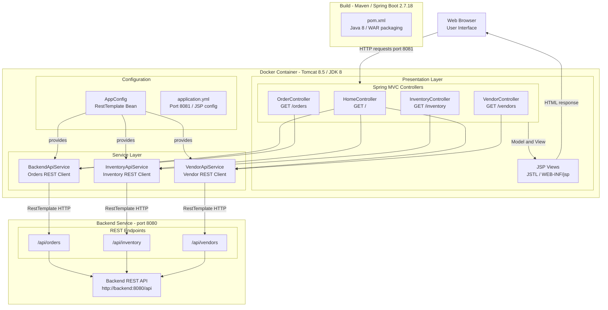

# Architecture Diagram

This diagram illustrates the current architecture of the SupplyChain Frontend application, a legacy Spring Boot web application packaged as a WAR file deployed on Apache Tomcat.

## Application Architecture

