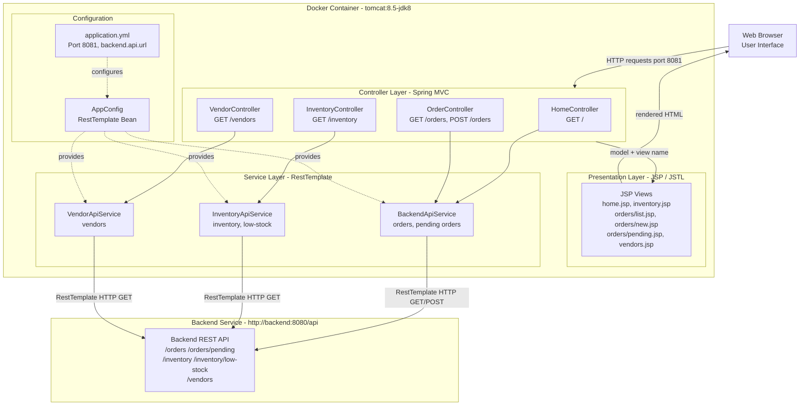

# Architecture Diagram

This diagram shows the current architecture of the SupplyChain Frontend application, a Spring Boot 2.7.18 WAR deployed on Tomcat 8.5 with JSP/JSTL views and RestTemplate-based backend integration.

## Application Architecture

